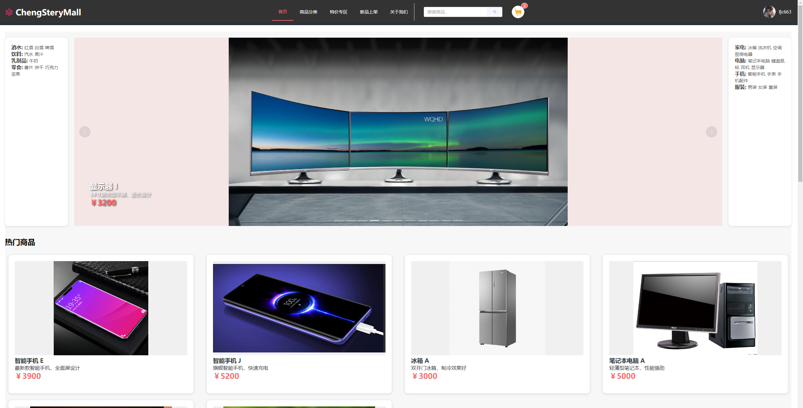
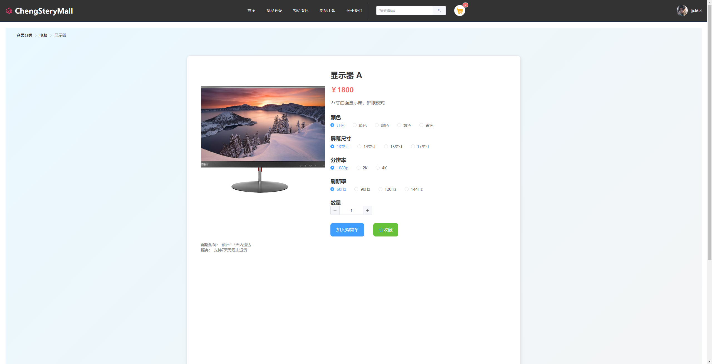
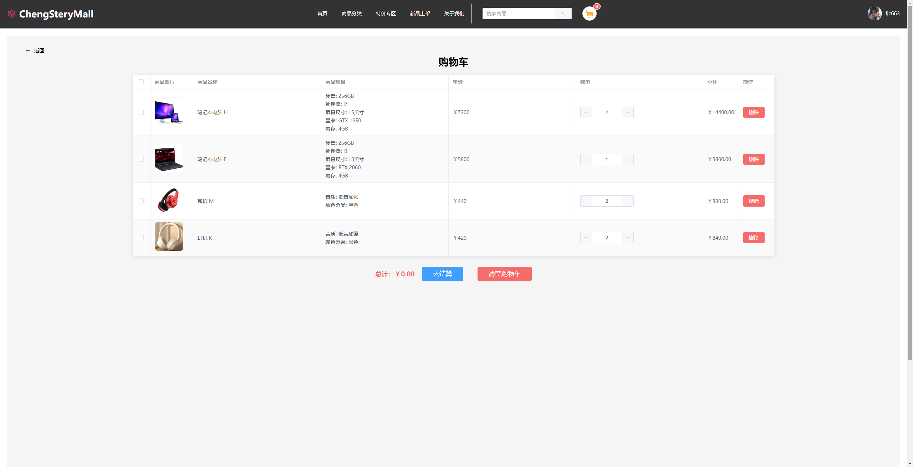
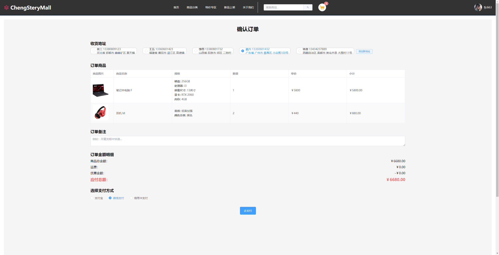
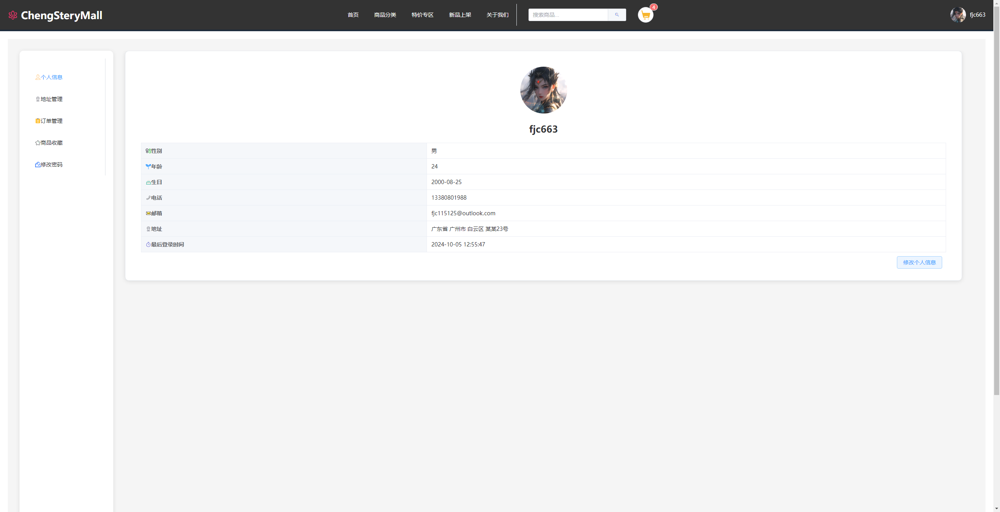
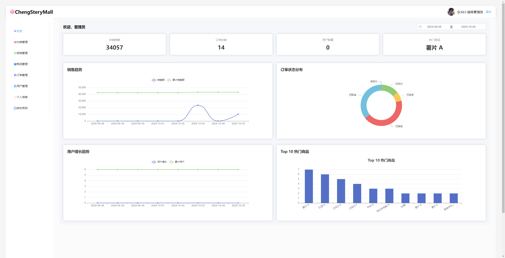
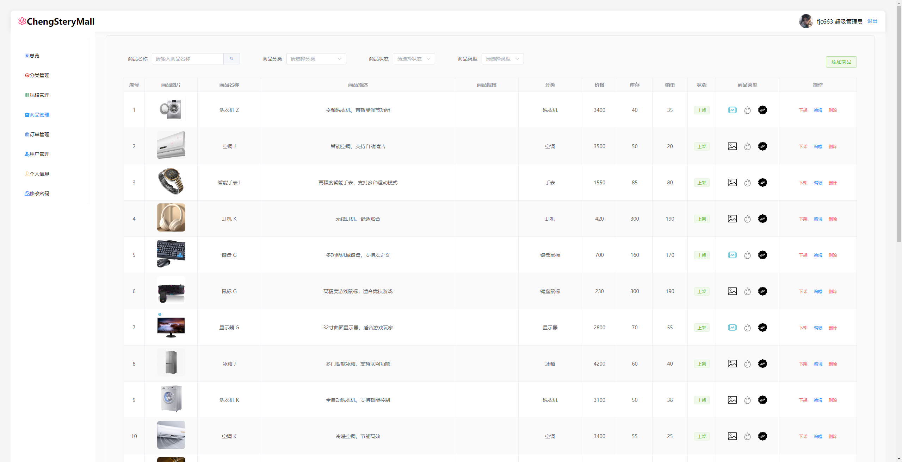
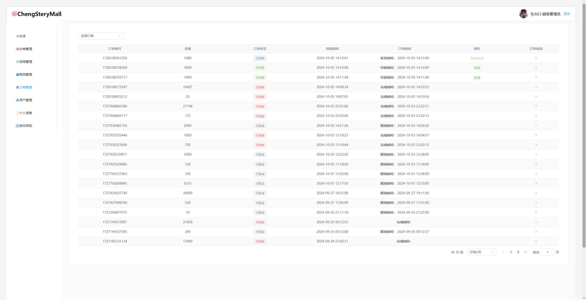
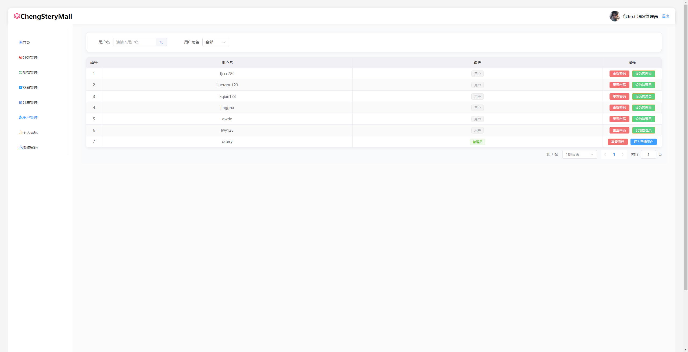

# cstery-mall

欢迎来到 **cstery-mall**，这是一个包含 **用户端** 和 **管理端** 的完整电商平台。

对应的后端项目: [https://github.com/fjc663/cheng-stery-mall](https://github.com/fjc663/cheng-stery-mall)

---

## 项目概述

- **用户端**：简洁直观的平台，用户可以浏览商品、购物并管理个人账户。
- **管理端**：功能全面的后台，管理员可以管理商品、订单、用户和数据分析。

### 主要功能：

#### 用户端：
- **商品浏览**：支持商品筛选和排序，提供详细的商品页面和分类浏览。
- **购物车与结算**：添加商品至购物车，管理商品数量，**支付板块暂时未完成**。
- **用户账户管理**：管理个人信息，查看订单历史等。

#### 管理端：
- **商品管理**：增加、更新、删除商品，编辑商品描述、价格、库存。
- **订单管理**：跟踪订单，管理订单状态。
- **数据分析仪表盘**：可视化报告销售数据。

---

## 运行项目

### 安装步骤

1. **克隆仓库**：
   ```bash
   git clone https://github.com/fjc663/cstery-mall.git
   ```

2. **安装依赖**：
   进入项目目录并运行：
   ```bash
   npm install
   ```

3. **运行开发服务器**：
   ```bash
   npm run dev
   ```
   用户端和管理端将在本地运行。端口为5173

4. **访问**

   用户端访问: [http://localhost:5173/](http://localhost:5173/)  
   管理端访问: [http://localhost:5173/admin/](http://localhost:5173/admin/)

---

## 关键页面

### 用户端

1. **主页**：
   - 展示特色商品和分类，简洁易用的界面。
   - 展示热门商品和新品。
   
   
2. **商品详情页**：
   - 显示商品图片、描述、评分和用户评价。
   - 支持尺寸、颜色和数量选择。
   
   
3. **购物车页面**：
   - 可选择要进行结算的商品去支付。
   
   


4. **结算页面**：
   暂未实现

5. **个人中心**：
   - 查看历史订单、管理个人信息。
   - 支持收藏商品和保存地址以便快速使用。
   

### 管理端

1. **仪表盘**：
   - 商品、订单和用户管理的中央枢纽。
   - 显示总销售额、热门商品等关键指标。
   

2. **商品管理**：
   - 增加、编辑或删除商品。
   - 管理分类和库存。
   

3. **订单管理**：
   - 查看所有订单，包括订单的各种状态，如支付状态。
   - 可对支付的订单进行发货操作。
   

4. **用户管理**：
   - 管理用户，用户角色分为超级管理员、管理员和普通用户。
   - 有重置密码和设置用户角色的功能。
   

---

## 未来改进
我们计划为项目扩展以下功能：
- **个性化推荐**：根据用户行为进行个性化商品推荐。
- **高级管理报告**：提供更深入的销售和营销性能分析。
- **移动端支持**：使用相同的后端 API 集成跨平台移动应用。

欢迎提出改进建议！

---
